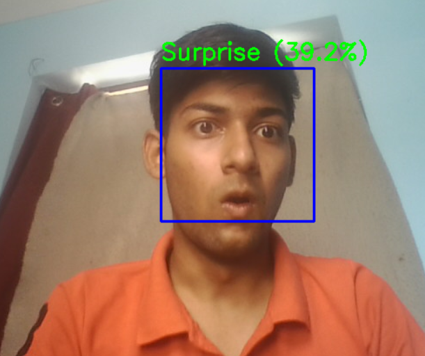

# 😃 Emotion Detector

This project is an AI-powered **Emotion Detection** system that detects human facial emotions in real-time using a webcam. It uses computer vision and deep learning to classify emotions such as:

- **Happy**
- **Sad**
- **Angry**
- **Surprised**
- **Neutral**

---

## 📸 Sample Results

Below are examples of the model's predictions on various emotions detected through facial expressions:

### 😠 Angry (70.7%)

---

### 😀 Happy (96.5%)

---

### 😢 Sad (48.4%)

---

### 😲 Surprise (39.2%)

---

### 😐 Neutral (65.7%)
)

---

## 🛠 Technologies Used

- Python 🐍
- OpenCV 📸
- TensorFlow / Keras 🧠
- Pre-trained CNN models
- Numpy & Matplotlib

---
